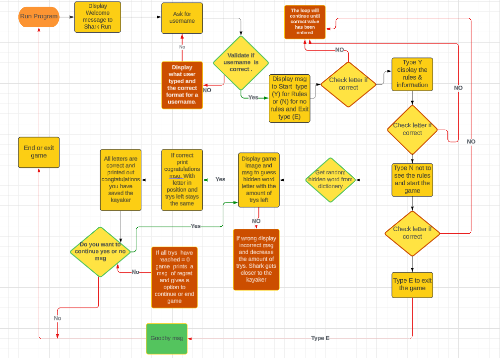
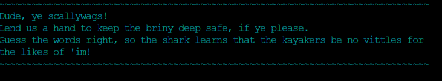

# Shark-Run 

Welcome to Shark-Run live program [Shark-Run](https://shark-run-e1a617839e7e.herokuapp.com/).

The game is a word-guessing game similar to the old hangman game.
Only in this game, do you have a kayaker and a shark chasing the kayaker.
The reality is we should learn to live in the same world with each other and learn from each other.
The dictionary words are based on the shark and kayak words.

# Contents
* [Shark-Run](#shark-run)
* [User Experience](#user-experience)
  * [User Stories](#user-stories)
  * [Creation Process](#creation-process)
  * [Design Choices](#design-choices)
  * [Colour used from Colorama](#colour-used-from-colorama)
  * [How to play](#how-to-play)
* [Features](#features)
  * [Existing Features](#existing-features)
  * [Inspiration](#inspiration)
  * [Future Features](#future-features)
* [Data Model](#data-model)
* [Technologies Used](#technologies-used)
* [Python Packages](#python-packages)
* [Testing](#testing)
* [Deployment](#deployment)
* [Credits](#credits)
* [Acknowledgements](#acknowledgements)
  
# User Experience

## User Stories

- The user should have a simplistic feel so that the game is easy to follow and understand.
- The old sailor language used might be different for some users but as they go along it comes to be very simple.
- The goal was to add something different with some humor with a good visual experience for the user.

### Primary Goal 

- The main goal is to have a bit of fun guessing the letters of the words.

### Visitor Goal

- The visitor should easily run the program and play the game.
- Winning or losing is not the goal only enjoying the game.

## Creation Process
### Planning

- I knew I was going to do a word-guessing game similar to a hangman game.
- So I took time to think about the visual experience with some brainstorming.
- I came up with a kayaker being chased by a shark as kayaking is a hobby of mine and I love the ocean including sharks.
- So once the idea was hatched searched words for the dictionary and images for the helper file.
- Then once most of the rough ideas were there I needed a tool to structure things this is why I used a flow chart.
- Programming in Python was a natural feeling to it the love-sandwitches of were enouph to help with my code.
- I generally wrote one function then tested it and fixed or added code to this function before moving to the next function.
- All the preparation before starting to code helped me in writing the code.
   
### Flow chart 

- The flow chart was the start of this project to make a rough idea of how the game is going to work.
- It helped to organize what section to do first and what was next in line.
- It created a structure of which function should start and where to end.
- Before moving to the next section I corrected error messages and problems then moved on to the next step.

  
## Design Choices

- The app is built in a display window of 80 characters per line and a max of 24 
  lines.
- dependencies are added to the requirements.txt.
- I wanted the game to flow from one function to the next in the  Python language.
- I created a helper file called shark as this helped to keep the code easy to read in the main code file.
- The helper file also keeps all the art and added functions, to a minimum in the main code.
- This makes for easier implementation and error handling.
- The language used is an old sailer nautical language as it fits with them and is different.
- after the welcome message the player has an opportunity to insert a player name or username for a better word.
- Certain messages have ASCII art as this personalized the experience with often the username displayed and information in others.
- The ASCII art also plays a role in displaying a color-changing image indicating to the user that they are reaching critical life 
  levels.
- Implemented error message should they have used the incorrect value or correct value.  
  
## Colour used from Colorama  

- I used some of the colors provided by Colorama (RED, GREEN, YELLOW, BLUE, MAGENTA, CYAN, WHITE)
- For this game, I chose CYAN as it is the closer color to the ocean for the start of the game.
- Other colors were YELLOW and RED to signify to the user the shark is getting closer with each incorrect answer.
- GREEN was used for the instructions and when you win the game. 

## How to play

- You have to guess the letter of the hidden word and the words are related to shark and kayak.
- When you guess incorrectly the shark gets closer to your kayak.
- You have six lives, So you have six times to guess the letters of the word.
- If you do guess correctly a life will not be deducted.
- If you use other letters and characters it will give you an error but a life won't be deducted.

[Back to top](#contents)

## Features

### Existing Features

#### Welcome Message 

- To make the user feel welcome to play and have fun.

#### Username input.

- This feature checks that the username is 1-15 characters. 
- Using regular exprestion code that will check that it's only alphabet letters from aA-zZ only.
- When correct the below message with show:)

- Should you use any other characters, numbers or anything else except alphabet letters will be seen as incorrect.
- An error message will print indicating what is required and you will need to enter it again:(

#### Game Rules 

- This allows the user to choose if they want to see instructions or not.
- When the user presses Y it will print the message below.

- when the user says N then it will also print a message and then start the game.

- Once they have seen the instructions and want to exit they can do so, this provides two exit points.
- One would be at the start of the game and one at the end of the game as the message gets printed.

#### Game Start 

- Finally, we start the game after the letter N was selected.
- First, a random word is selected from a dictionary code to display the length of the word with underscores.
- Guessed letters are displayed on top  
- An image of a shark chasing a kayaker appears.
- There are three colors in the six lives you have, each changing after every second life taken.
- The shark gets closer to your kayak with each word guessed incorrectly as seen below.

##### Lives 6 - 5

##### lives 4 - 3

##### lives 2 - 1

#### Error handling 

- When correctly guessed letter a message below is printed.

- When the user uses incorrect values that are not letters a message will be printed.

- If a letter is not in the word the message below will be printed.

- If the user types the same letter again a message will be printed.

#### Win Message

- The win message prints an art image with the username and congratulates the user 

#### loose Message 

- When the user loses prints a message.

#### Restart option 

- After each win or lose message the user is given the option to play again or not.

#### Inspiration

- I wanted something different that matched my interests and hobbies.
- One of my hobbies is kayaking and this is where I got the inspiration to make this game my own.
  
#### Future Features

- I would add more words to the dictionary separating them into easy, hard, and difficult.
  It would have been great also to supply a hint for each word to guess.
- Some players would have liked to select the difficulty of the game in this case would make the lives less for each level.
- Some players like a score count that they can improve as they go along this might be another future feature.  
 
## Data Model

- The game is built on functions in the game and no external API is used.
- I have two -py files one that runs the game and the other that contains the helper files such as art or functions.
- Certain python packages have been used as indicated below technologies used.
- Heruku is an automatic deploy so any changes to the file update Heruku automatically.  
   
## Technologies Used

- [Gitpod](https://www.gitpod.io/#get-started) - used to deploy the website.
- [Github](https://github.com/) - used to host and edit the website.
- [Python](https://www.python.org/) 
- [perplexity](https://www.perplexity.ai/) - This was used for the dictionary and 
  the Nautical language used in the game.
- [PEP8ci](https://pep8ci.herokuapp.com/#) - This was used to validate.
- [Heruku](https://id.heroku.com/login) - Used to deploy the game.
- [Asciiart](https://www.asciiart.eu) - Used for the display art.
- [Lucid Chart](https://www.lucidchart.com/pages/de) -Used to creat the flow chart.

## Python Packages

- [Colorama](https://pypi.org/project/colorama/) - Used in the art images for color.
- [Time](https://docs.python.org/3/library/time.html) - Used to create a time pause for messages.
- [OS](https://docs.python.org/3/library/os.html) - Used to clear the console and keep it tidy. 
- [Random](https://docs.python.org/3/library/random.html) - Used to select a random word from the dictionery.

[Back to top](#contents)
  
## Testing 

### Manual Testing

- I tested the app in the console many times and later after deploying it in the Heruku app.
- After the deployment I tested with one person then two and increased the amount of people who do not play games.
  - The reason was that I wanted to see what the experience was and the feedback was mainly good.
  - Also they were good to test with as they do not play often so nice to see if they got along with the game and they did.
  - I also tested it with gamers and they liked it as well of course their expectations are higher in terms of graphics. 

### Validator Testing

- The code was checked using the CI Python Linter all errors were corrected and cleared.

#### Run.py cleared errors

- 

##### Errors found

- Errors found and repaired 

- [Error-1-Pep8ci](gallery/error-1-run.png)
- [Error-2-Pep8ci](gallery/error-2-run.png)
- [Error-3-Pep8ci](gallery/error-3-run.png)
- [Error-4-Pep8ci](gallery/error-4-run.png)

           
#### Shark.py cleared errors

- 

##### Errors found   

- Errors found and repaired 

- [Error-shark-1-Pep8ci](gallery/shark-1.png)
- [Error-shark-2-Pep8ci](gallery/shark-2.png)
- [Error-shark-3-Pep8ci](gallery/shark-3.png)

### Fixed Bugs

- The game is built on functions in the game and no external API is used.
- I had a typeErrors as my function in shark.py did not pass the correct arguments to the run.py.
  - An example of this type of error where (TypeError: input expected at most 1 argument, got 2).
  - This was repaired by passing the correct arguments to each file so when called there is no error.
  - Throughout the project, I often had to ensure that the functions were called properly from the main function and in the code.
- In the guess-word-letter function was not printing the correct underscores for the word and was confusing for other players.
  - To correct this I found that my print command in the function was incorrect so the code was changed to this code: print(' '.join(letter_word)).
- I had art messages and because of the graphics in them they had \ this created errors in Python the solution was to use the r and f string prefixes together.
  - This enabled me to keep the graphics as is and call data in the message such as a username for example.
- I have to say there were other bugs that I just can not remember as I went on fixing them from one line of code to the next.

### Unfixed Bugs
 
- There are no unfixed bugs that are known to me in this app.

[Back to top](#contents)

## Deployment

This project was deployed using Code Institute's mock terminal for Heroku.

The steps for deployment are:

- Create a new Heroku app with a unique name and the region
- In the "settings" tab, set the buildpacks to 'Python' and 'NodeJS' (the order is important)
- Link the Heroku app to the GitHub repository
- In case it is wished, enable "automatic deploys" to automaticly update the app in case of a new commit
- Click on Deploy in the "manual deploy" area

The instruction link below on how to fork a project:

[Fork the project](https://docs.github.com/en/pull-requests/collaborating-with-pull-requests/working-with-forks/fork-a-repo)

The instruction link below on how to clone a project:

[Clone the project](https://docs.github.com/en/repositories/creating-and-managing-repositories/cloning-a-repository) 

## Credits 

- [W3schools](https://www.w3schools.com/)
- [Stackoverflow](https://stackoverflow.com/)
- [W3docs](https://www.w3docs.com/)
- [python.org](https://docs.python.org/3/library/re.html)
- [geeksforgeeks](https://www.geeksforgeeks.org/clear-screen-python/)

### Content

- [perplexity](https://www.perplexity.ai) Used for the sailer language and dictionery words.

### Media

- [Youtube](youtube.com) Used to for research on coding in python.

## Acknowledgements

- I would like to thank my fellow student Sebastian K for providing good troubleshooting ideas when I was stuck on bugs or problems it is nice to have support in 
  these times.
- Also a special mention to Jan R my fellow student for helping with the testing of the app as he gave me valuable insight into the game.
- To all family and friends who also tested the app thank you.
- Thank you to my mentor who has helped guide me in this project.

[Back to top](#contents)   