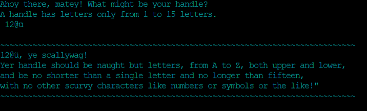

# Shark-Run 

Welcome to Shark-Run live program [Shark-Run](https://shark-run-e1a617839e7e.herokuapp.com/).

The game is a word-guessing game similar to the old hangman game.
Only in this game, do you have a kayaker and a shark chasing the kayaker.
The reality is we should learn to live in the same world with each other and learn from each other.
The dictionary words are based on the shark and kayak words.

# Contents
* [**Shark.Run**](#shark-run)
* [**User Experience**](#user-experience)
    * [User Stories](#user-stories)
    * [Creation Process](#creation-process)
    * [Design Choices](#design-choices)
    * [Colour used from colorama ](#colorama)
* [**How to play**](#how-to-play)
* [**Features**](#features)
   * [Existing Features](#existing-Features)                        
   * [**Inspiration**](<#inspiration>)
   * [**Future Features**](<#future-features>)
* [**Data Model**](<#data-model>)   
* [**Technologies Used**](<#technologies-used>)
* [**Python Packages**](<#python-packages>)
* [**Testing**](#testing)
* [**Deployment**](#deployment)
* [**Credits**](#credits)
* [**Acknowledgements**](#acknowledgements)
  
# User Experience

## User Stories

- The user should have a simplistic feel, so that the game is easy to follow and understand.
- The old sailer language used might be different for some users but as they go along it comes to be very simple.
- The goal was to add something differant with some humour with a good visual experiences for the user.

### Primary Goal 

- The main gaol is to have a bit of fun guessing the letters of the words.

### Visitor Goal

- The visitor should easly run the program and play the game.
- Winning or loosing is not really the goal only enjoying the game.

## Creation Process
### Planning

- I knew I was going to do a word-guessing game similar to a hangman game.
- So I took time to think about the visual experience with some brainstorming.
- I came up with a kayaker being chased by a shark as kayaking is a hobby of mine and I love the ocean including sharks.
- So once the idea was hatched searched words for the dictionary and images for the helper file.
- Then once most of the rough ideas was there I needed a tool to structure things this is why I used a flow chart.

### Flow chart 

- The flow chart was the start of this project to make a rough idea of how the game is going to work.
- It helped to organize what section to do first and what was next inline.
- It created a structure of which function should start and where to end.
- Before moving to the next section I corrected error messages and problems then moved on to the next step.

  
## Design Choices

- The app is built in a display window of 80 characters per line and a max of 24 
  lines.
- dependencies are added to the requirements.txt.
- I wanted the game to flow from one function to the next in the  Python language.
- I created a helper file called shark as this helped to keep the code easy to read in the main code file.
- The helper file also keeps all the art and added functions, to a minimum in the main code.
- This makes for easier implementation and error handling.
- The language used is an old sailer nautical language as it fits with them and is different.
- after the welcome message the player has an opportunity to insert a player name or username for a better word.
- Certain message have asciiart as this personilized the experience with often the username displayed and information in others.
- The asciiart also plays also a role in displaying an color changing image indicating to the user that they are reaching critical life 
  levels.
- Implemented error message should they have used the incorrect value or correct value.  
  
## Colour used from colorama  

- I used some of the colors provided by Colorama (RED, GREEN, YELLOW, BLUE, MAGENTA, CYAN, WHITE)
- For this game, I chose CYAN as it is the closer color to the ocean for the start of the game.
- Other colors were YELLOW and RED to signify to the user the shark is getting closer with each incorrect answer.
- GREEN was used for the instructions and when you win the game. 

## How to play

- You have to guess the letter of the hidden word and the words are related to shark and kayak.
- When you guess incorrectly the shark gets closer to your kayak.
- You have six lives, So you have six times to guess the letters of the word.
- If you do guess correct a life will not be deducted.
- If you use other letters and characters it will give you a error but a life won't be deducted.

[Back to top](#contents)

## Features

### Existing Features

#### Welcome Message 

- To make the user feel welcome to play and have fun.

#### Username input.

- This feature checks that the username is 1-15 characters. 
- Using regular exprestion code that will check that its only alphabet letters from aA-zZ only.
- When correct the below message with show:)

- Should you use any other characters, numbers or anything else except alphabet letters will be seen as incorrect.
- An error message will print indicating what is required and you will need to enter it again:(

#### Game rules 

- This allows the user to choose if they want to see instructions or not.
- When the user presses yY it will print the message below.

- when the user says nN then it will also print a message and then start the game.

- Once they have seen the instructions and want to exit they can do so, this provides two exit points.
- One would be at the start of the game and one at the end of the game as the message gets printed.

#### Game Start 

- Finally, we start the game after the letter N was selected.
- First, a random word is selected from a dictionary code to display the length of the word with underscores.
- Guessed letters are displayed on top  
- An image of a shark chasing a kayaker appears.
- There are three colors in the six lives you have, each changing after every second life taken.
- The shark gets closer to your kayak with each word guessed incorrectly as seen below.

##### Lives 6 - 5

##### lives 4 - 3

##### lives 2 - 1

#### Error handeling 

- When correctly guessed letter a message below is printed.

- When the user uses incorrect values that are not letters a message will be printed.

- If letter is not in the word the message below will be printed.

#### Win Message
- The win message prints a art image with the username and congratulates the user 

#### loose Message 

- When the user looses prints a message.

#### Restart option 

- After each win or loose message the user is given the option to play again or not.

#### Inspiration

- I wanted somthing differant that matches my interests and hobbys.
- One of my hobbys is kayaking and this is where I got the insperation to make this game my own.
  
#### Future Features

 - Function 
 
## Data Model
   
## Technologies Used

- [Gitpod](https://www.gitpod.io/#get-started) - used to deploy the website.
- [Github](https://github.com/) - used to host and edit the website.
- [Python](https://www.python.org/) 
- [perplexity](https://www.perplexity.ai/) - This was used for the dictionery and the Nautical language used in the game.
- [PEP8ci](https://pep8ci.herokuapp.com/#) - This was used to validate.
- [Heruku](https://id.heroku.com/login) - Used to deploy the game.
- [Asciiart](https://www.asciiart.eu) - Used for the display art.

## Python Packages

- [Colorama](https://pypi.org/project/colorama/)
- [Time](https://docs.python.org/3/library/time.html)
- [OS](https://docs.python.org/3/library/os.html)
- [Random](https://docs.python.org/3/library/random.html)

[Back to top](#contents)
  
## Testing 

### Manual Testing

### Validator Testing 

- [Pep8ci](https://pep8ci.herokuapp.com/#)
     

- 
            
- cleared errors Result

- 

   

### Fixed Bugs

- game problems 

### Unfixed Bugs
 
- Unfixed bugs 

[Back to top](#contents)

## Deployment

Deployed the site on GitHub using the following procedure:
-Heruku
1. By

The instruction link below on how to fork a project:

[Fork the project](https://docs.github.com/en/pull-requests/collaborating-with-pull-requests/working-with-forks/fork-a-repo)

The instruction link below on how to clone a project:

[Clone the project](https://docs.github.com/en/repositories/creating-and-managing-repositories/cloning-a-repository) 

## Credits 

- [W3schools](https://www.w3schools.com/)
- [Stackoverflow](https://stackoverflow.com/)
- [Youtube](youtube.com)
- [W3docs](https://www.w3docs.com/)

### Content

### Media

## Acknowledgements

- I would like to thank my fellow student Sebastian Kefer for providing good troubleshooting ideas when I was stuck on bugs or problems it is nice to have support in these times.
- Thank you to my mentor who has helped guide me in this project.

[Back to top](#contents)   